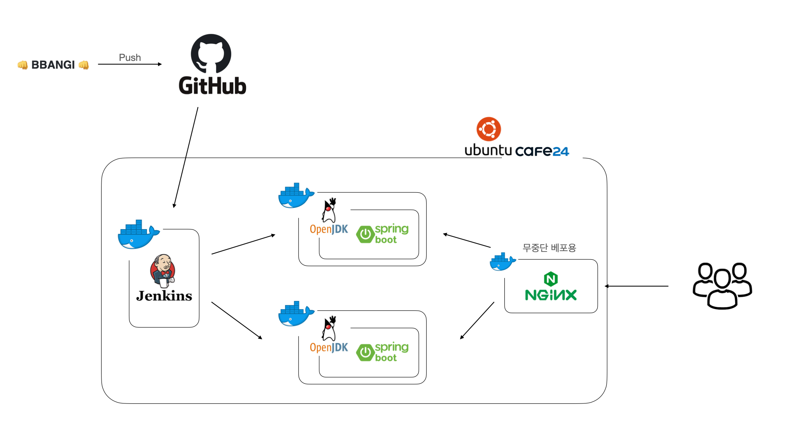
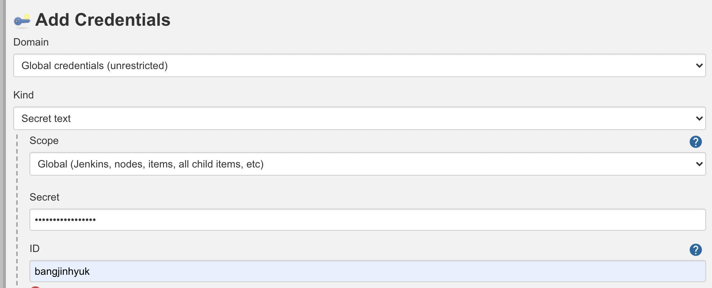
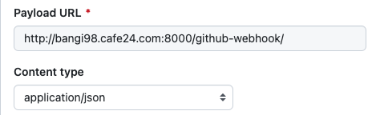

# Docker-Jenkins-Springboot-CICD

## 환경
 - cafe24 가상 리눅스 서버 (ubuntu 20.04)
 - Spring boot 
 - openjdk 11
## 목표 


### 7/27 
 1. 도커 설치 및 docker-compose 설치 
 2. 기본 예제 Spring boot 프로젝트 준비 localhost:9090/api/hello에 접속을 통해 문장 춣력 
 3. 젠킨스 설치 및 깃허브 연동, 젠킨스 컨테이너 생성
    ```
        $ mkdir compose && cd compose
        $ mkdir jenkins-dockerfile && cd jenkins-dockerfile
        $ vim Dockerfile
    ```
    ```dockerfile
    FROM jenkins/jenkins:lts
    USER root
    RUN apt-get update &&\
        apt-get upgrade -y &&\
        #호스트 ssh접속을 위한 설치
        apt-get install -y openssh-client  
    ```
    ```
        $ cd ..
        $ vim docker-compose.yml
    ```
    ```yaml
    version: "3"
    services:
      jenkins:
        container_name: jenkins-compose
        build:
          context: jenkins-dockerfile
          dockerfile: Dockerfile
        user: root
        ports:
          - 8000:8080
          - 8888:50000
        volumes:
        # cafe24 = root ec2 = home/ubuntu 로 경로가 다름 
        # 왼쪽이 인스턴스 경로: 오른쪽이 도커 컨테이너 경로  
          - /root/compose/jenkins:/var/jenkins_home
          - /root/compose/.ssh:/root/.ssh
    ```
    ```
        $ docker-compose up --build -d
        $ docker image ls
        $ docker ps
        $ docker logs jenkins-compose
    ```
     - 젠킨스 비밀번호 확인 후 http://[주소-입력]:8000 접속하여 입력 해주고 기본 설치 해주기 
     - 플러그인 관리에서 github integration 검색하여 설치 
     - 젠킨스 재부팅후 새로운 item을 눌러 Freestyle project 입력 
     - 소스코드 관리 깃을 눌러 Repository URL 입력 Credentials 에는 깃허브 세팅에 Developer setting 에서 다음과 같이 토큰 생성 한것을 넣어주기 
     
       
     
    
     - 브랜치는 main, 빌드 유발 GitHub hook trigger for GITScm polling 선택
     - Build 는 Excute shell 선택하여 다음 커멘드 입력 
       ```
       ./gradlew clean build
       ```
     - 리포지토리 세팅에서 Webhooks 에서 추가
       
       
     - 그 후 빌드를 눌러 빌드를 해본뒤 readme를 수정하여 깃 푸시를 통해 콘솔을 확인하며 입력 커멘드가 잘 활성화 되었는지 확인 
 4. Spring Boot 컨테이너 생성
    
     - 빌드 된 jar 파일 위치 및 파일명 확인 
    ```
       $ ls ./jenkins/workspace/{jenkins item 이름}/build/libs
    ```
    ```
       $ mkdir spring-dockerfile && cd spring-dockerfile
       $ vim Dockerfile
    ```
    ```dockerfile
        FROM openjdk:11-jre-slim
    
        ENTRYPOINT java -jar /deploy/hello-0.0.1-SNAPSHOT.jar
        
        EXPOSE 9090
    ```
    ```yaml
    version: "3"
    services:
      jenkins:
        container_name: jenkins-compose
        build:
          context: jenkins-dockerfile
          dockerfile: Dockerfile
        user: root
        ports:
          - 8000:8080
          - 8888:50000
        volumes:
        # cafe24 = root ec2 = home/ubuntu 로 경로가 다름 
        # 왼쪽이 인스턴스 경로: 오른쪽이 도커 컨테이너 경로  
          - /root/compose/jenkins:/var/jenkins_home
          - /root/compose/.ssh:/root/.ssh
       spring:
        container_name: spring-compose
        build:
          context: spring-dockerfile
          dockerfile: Dockerfile
        ports:
          - 9090:9090
        volumes:
          - /root/compose/jenkins/workspace/exam/build/libs:/deploy
    ```
    ```
        $ docker-compose up --build -d
        $ docker image ls
        $ docker ps
    ```
    - 이제 만들어둔 예제 스프링 코드로 접속 확인
     
 5. 자동 베포 
    ```
        $ docker exec -it jenkins-compose bash
        $ ssh-keygen -t rsa
        $ cat /root/.ssh/id_rsa.pub
        // 키 복사 하기 ssh-rsa 부터 끝까지 
        $ exit
        $ vim ~/.ssh/authorized_keys
    ```
    - 복사해둔 키 추가 하고 컨테이너에서 로컬로 접속 시도 해보기 
    ```
        $ docker exec -it jenkins-compose bash
        $ ssh root@$(/sbin/ip route | awk '/default/ { print $3 }')
        $ exit
    ```
    ```
        $ ssh -t -t root@$(/sbin/ip route | awk '/default/ { print $3 }') <<EOF
        > cd /root/compose
        > docker rm -f spring-compose
        > docker-compose up --build -d
        > exit
        > EOF
    ```
    - 위 명령어를 컨테이너 내에서 입력 후 실행 되는것 로그를 통해 확인 
    - 젠킨스 구성에서 커멘드 다음과 같이 수정 - 도커 캐싱부분 해결 
    ```
       ./gradlew clean build
        ssh -t -t root@$(/sbin/ip route | awk '/default/ { print $3 }') <<EOF
        cd /root/compose
        docker rm -f spring-compose
        docker-compose up --build -d
        exit
        EOF
    ```